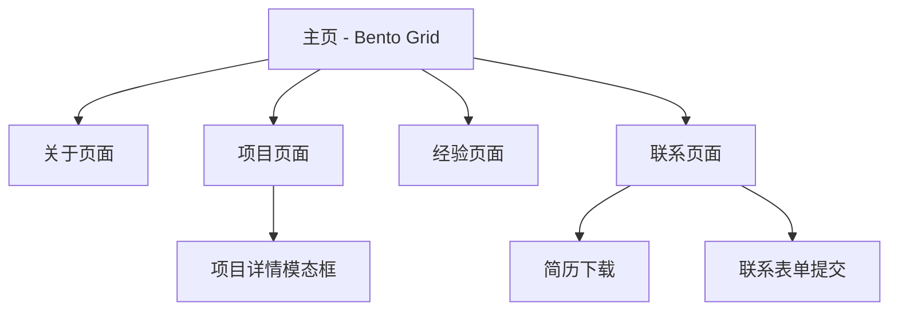

# Haoran Ji 个人作品集网站产品需求文档

## 1. Product Overview

为北京航空航天大学计算机科学专业大四学生季昊冉（Haoran Ji）打造的现代化个人作品集网站，采用Apple Bento Grid设计风格。

- 展示其在AI/机器学习领域的专业技能、项目经验和学术成就，帮助其在求职过程中脱颖而出。
- 目标用户包括潜在雇主、招聘人员、学术合作伙伴和技术社区成员。
- 通过现代化的视觉设计和交互体验，有效传达个人品牌价值和技术实力。

## 2. Core Features

### 2.1 Feature Module

我们的个人作品集网站包含以下主要页面：

1. **主页**：英雄区域、导航栏、Bento Grid布局的核心内容展示
2. **关于页面**：个人简介、教育背景、核心优势展示
3. **项目页面**：精选项目展示、技术栈、项目详情和GitHub链接
4. **经验页面**：工作经历、竞赛经历、课外活动展示
5. **联系页面**：联系方式、社交媒体链接、简历下载

### 2.2 Page Details

| Page Name | Module Name | Feature description |
|-----------|-------------|---------------------|
| 主页 | 英雄区域 | 个人头像、姓名、职业定位、核心标签展示，支持动态打字效果 |
| 主页 | Bento Grid布局 | 6-8个不同尺寸的卡片，展示项目预览、技能标签、GitHub统计、联系方式等 |
| 主页 | 导航栏 | 固定顶部导航，包含页面跳转、主题切换、语言切换功能 |
| 关于页面 | 个人简介卡片 | 详细自我介绍、专业背景、兴趣爱好展示 |
| 关于页面 | 教育背景 | 北航学历信息、GPA、主要课程成绩展示 |
| 关于页面 | 核心优势 | 机器学习经验、编程技能、语言能力等关键优势 |
| 项目页面 | 精选项目展示 | 3个主要项目的详细介绍，包含技术栈、功能特点、GitHub链接 |
| 项目页面 | 项目筛选 | 按技术栈或项目类型筛选项目 |
| 项目页面 | 项目详情模态框 | 点击项目卡片弹出详细信息、截图、演示链接 |
| 经验页面 | 工作经历 | 百度实习经历详细描述、工作内容、技术栈 |
| 经验页面 | 竞赛经历 | 数学建模竞赛参与经历和成果 |
| 经验页面 | 课外活动 | 学生组织参与经历、职责描述 |
| 联系页面 | 联系方式 | 邮箱、电话、LinkedIn、GitHub等联系方式 |
| 联系页面 | 联系表单 | 在线留言表单，支持姓名、邮箱、消息内容提交 |
| 联系页面 | 简历下载 | PDF简历下载按钮，支持中英文版本 |

## 3. Core Process

**访客浏览流程：**
用户访问网站首页，通过Bento Grid布局快速了解个人信息概览，点击感兴趣的卡片进入详细页面。在项目页面深入了解技术项目，在经验页面查看工作和学术背景，最后通过联系页面获取联系方式或下载简历。

**响应式交互流程：**
网站支持桌面端和移动端访问，Bento Grid在不同屏幕尺寸下自适应调整布局。所有交互元素支持触摸操作，确保移动端用户体验。

## 4. User Interface Design

### 4.1 Design Style

- **主色调**：深空灰 (#1d1d1f)、纯白 (#ffffff)
- **辅助色**：苹果蓝 (#007aff)、系统绿 (#30d158)、警告橙 (#ff9500)
- **按钮风格**：圆角矩形，支持悬停动画和点击反馈
- **字体**：SF Pro Display (英文)、PingFang SC (中文)，标题 24-48px，正文 16-18px
- **布局风格**：Bento Grid卡片布局，顶部固定导航，流畅的滚动动画
- **图标风格**：SF Symbols风格的线性图标，支持深色/浅色主题切换

### 4.2 Page Design Overview

| Page Name | Module Name | UI Elements |
|-----------|-------------|-------------|
| 主页 | 英雄区域 | 居中布局，大号标题字体，渐变背景，头像圆形裁剪，动态打字效果 |
| 主页 | Bento Grid | 2x4或3x3网格布局，卡片圆角12px，阴影效果，悬停放大动画 |
| 主页 | 导航栏 | 毛玻璃效果背景，居中logo，右侧菜单按钮，支持滚动隐藏/显示 |
| 项目页面 | 项目卡片 | 大图预览，标题+描述，技术标签，GitHub图标，悬停显示更多信息 |
| 联系页面 | 联系表单 | 简洁输入框设计，聚焦状态边框高亮，提交按钮加载动画 |

### 4.3 Responsiveness

网站采用移动优先的响应式设计，支持桌面端、平板端和移动端访问。Bento Grid在小屏幕设备上转换为单列布局，保持内容的可读性和交互的便利性。所有触摸交互经过优化，确保移动端用户体验流畅。