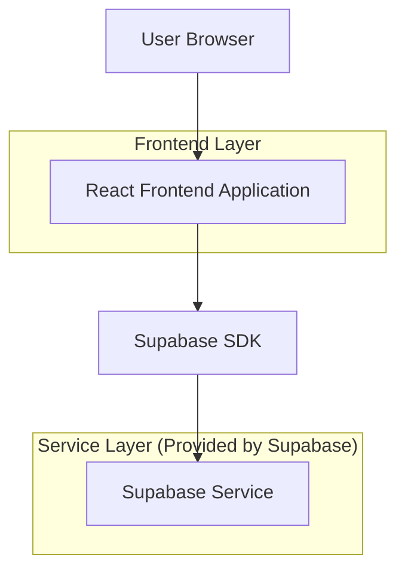
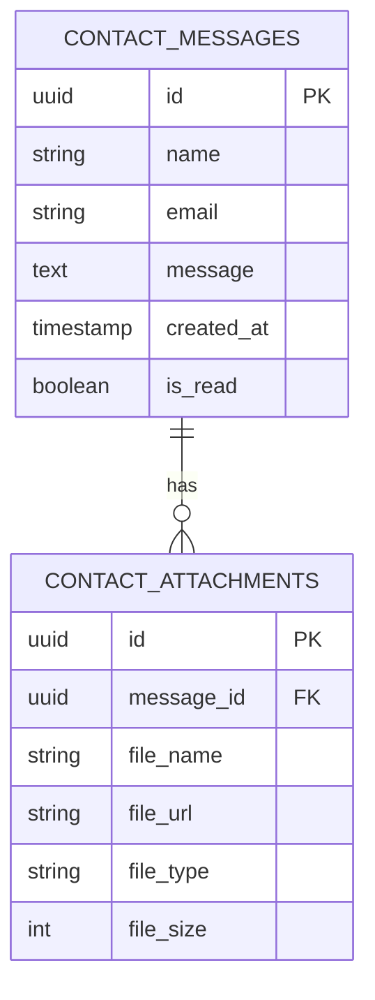

# Haoran Ji 个人作品集网站技术架构文档

## 1.Architecture design



## 2.Technology Description

* Frontend: React\@18 + Next.js\@14 + TailwindCSS\@3 + Framer Motion\@10

* Backend: Supabase (Authentication, Storage, Database)

## 3.Route definitions

| Route       | Purpose                  |
| ----------- | ------------------------ |
| /           | 主页，展示Bento Grid布局的个人信息概览 |
| /about      | 关于页面，展示个人简介、教育背景和核心优势    |
| /projects   | 项目页面，展示精选项目和技术栈          |
| /experience | 经验页面，展示工作经历、竞赛经历和课外活动    |
| /contact    | 联系页面，提供联系方式和简历下载         |

## 4.API definitions

### 4.1 Core API

联系表单提交

```
POST /api/contact
```

Request:

| Param Name | Param Type | isRequired | Description |
| ---------- | ---------- | ---------- | ----------- |
| name       | string     | true       | 发送者姓名       |
| email      | string     | true       | 发送者邮箱       |
| message    | string     | true       | 消息内容        |

Response:

| Param Name | Param Type | Description |
| ---------- | ---------- | ----------- |
| success    | boolean    | 提交状态        |
| message    | string     | 状态消息        |

Example Request:

```json
{
  "name": "招聘经理",
  "email": "recruiter@company.com",
  "message": "您好，我们对您的简历很感兴趣，希望能进一步了解您的情况。"
}
```

## 6.Data model

### 6.1 Data model definition



### 6.2 Data Definition Language

联系消息表 (contact\_messages)

```sql
-- 创建联系消息表
CREATE TABLE contact_messages (
    id UUID PRIMARY KEY DEFAULT gen_random_uuid(),
    name VARCHAR(100) NOT NULL,
    email VARCHAR(255) NOT NULL,
    message TEXT NOT NULL,
    created_at TIMESTAMP WITH TIME ZONE DEFAULT NOW(),
    is_read BOOLEAN DEFAULT FALSE
);

-- 创建附件表
CREATE TABLE contact_attachments (
    id UUID PRIMARY KEY DEFAULT gen_random_uuid(),
    message_id UUID REFERENCES contact_messages(id) ON DELETE CASCADE,
    file_name VARCHAR(255) NOT NULL,
    file_url TEXT NOT NULL,
    file_type VARCHAR(50) NOT NULL,
    file_size INTEGER NOT NULL,
    created_at TIMESTAMP WITH TIME ZONE DEFAULT NOW()
);

-- 创建索引
CREATE INDEX idx_contact_messages_created_at ON contact_messages(created_at DESC);
CREATE INDEX idx_contact_attachments_message_id ON contact_attachments(message_id);

-- 设置权限
GRANT SELECT ON contact_messages TO anon;
GRANT ALL PRIVILEGES ON contact_messages TO authenticated;

GRANT SELECT ON contact_attachments TO anon;
GRANT ALL PRIVILEGES ON contact_attachments TO authenticated;
```

